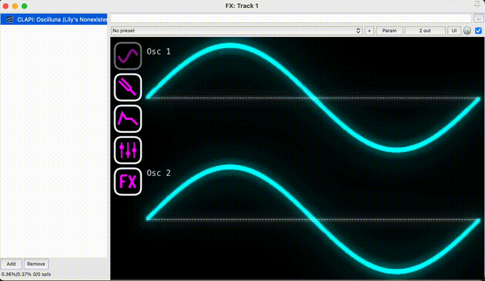

# Oscilluna

> Note: Oscilluna is in early development. Expect things to be a bit messy for now!

Oscilluna is a synthesizer that lets you draw your own waveforms. You can then apply a range of synthesis techniques like FM modulation, volume envelopes, filters, and various effects.

It is coded using [Cmajor](https://cmajor.dev/) for audio/DSP, and TypeScript for the view.

## Usage

### Example



### Steps

To use the synthesizer there are a few options.

- The quickest way is to use the web version on the [demo page](https://lilyvanoekel.github.io/Oscilluna/demo.html).
- If you want to use it as a plugin have a look at the installation steps below.
- If you want to noodle with it in VSCode:
  - Check out the repo.
  - Install `cmajor tools` in VSCode.
  - Press `Ctrl-Shift-P` / `Cmd+Shift+P`.
  - Run `Cmajor: Run patch`.

## Installation

### Windows Clap

- Make sure you have the [Microsoft Visual C++ Redistributable for Visual Studio 2022](https://learn.microsoft.com/en-us/cpp/windows/latest-supported-vc-redist?view=msvc-170) installed.
- Download `Oscilluna.clap` from the latest release and place it under `C:\Program Files\Common Files\Clap`.
- Load it in a host that supports CLAP plugins such as [Reaper](https://www.reaper.fm/) or [Bitwig](https://www.bitwig.com/).

### Other Platforms and Formats

Instructions and builds should hopefully be coming soon.

If you are feeling adventurous, follow the steps below to build it yourself.

## Building

### View

The view is a simple Vite app. The `dist` folder is committed to source control so it does not need to be built separately. If you are interested in playing around with the code and want to develop and build, please have a look at the [README.md](https://github.com/lilyvanoekel/Oscilluna/blob/main/view/README.md) file in the `view` folder.

### Cmajor / Oscilluna

Building Oscilluna should be the same as any other [Cmajor](https://cmajor.dev/) project. You should be able to find instructions on their [website](https://cmajor.dev/) or [github](https://github.com/cmajor-lang/cmajor) on how to perform these steps for your environment. As the view comes prebuilt, no other dependencies should be needed.

A few options are, using Cmajor tools to:

- output a web assembly.
- output a [CLAP](https://github.com/free-audio/clap) plugin project and then compiling that.
- output a [JUCE](https://juce.com/) project and then compiling that into various plugin formats or a standalone app.

Please refer to the resources linked above for more options and help with this. I'm sharing the commands below that I used to compile the CLAP/JUCE projects generated with the Cmajor tooling, as these were not immediately obvious to me, but this doesn't cover all steps required.

#### Build CLAP on Windows

After outputting a CLAP project, and downloading [CLAP](https://github.com/free-audio/clap) itself into `C:\projects\clap\include`, I ran the following commands from the `clap` project folder:

```
cmake -B build -DCLAP_INCLUDE_PATH="C:\projects\clap\include" -DCMAKE_BUILD_TYPE=Release
cmake --build build --config Release
```

#### Build JUCE on Windows:

From where the Cmajor tooling saved your JUCE project:

```
cmake -B build -DJUCE_PATH="C:\projects\JUCE" -DCMAKE_BUILD_TYPE=Release
cmake --build build --config Release
```

#### Build CLAP on OSX:

From where the Cmajor tooling saved your CLAP project (replace the path to [CLAP](https://github.com/free-audio/clap)):

```
cmake -B build -DCLAP_INCLUDE_PATH="/Users/lily/projects/clap/include" -DCMAKE_BUILD_TYPE=Release
cmake --build build --config Release
```
